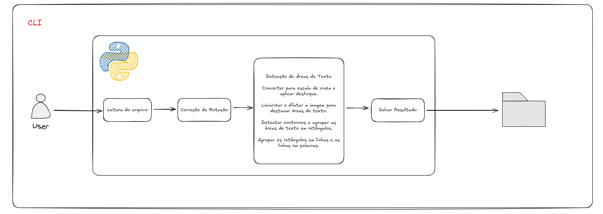
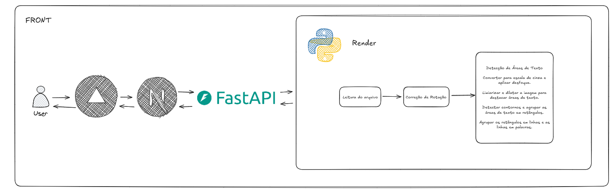

# Redação Detector

```bash

    ██████╗ ███████╗██████╗  █████╗  ██████╗ █████╗  ██████╗       ██████╗ ███████╗████████╗███████╗ ██████╗████████╗ ██████╗ ██████╗ 
    ██╔══██╗██╔════╝██╔══██╗██╔══██╗██╔════╝██╔══██╗██╔═══██╗      ██╔══██╗██╔════╝╚══██╔══╝██╔════╝██╔════╝╚══██╔══╝██╔═══██╗██╔══██╗
    ██████╔╝█████╗  ██║  ██║███████║██║     ███████║██║   ██║█████╗██║  ██║█████╗     ██║   █████╗  ██║        ██║   ██║   ██║██████╔╝
    ██╔══██╗██╔══╝  ██║  ██║██╔══██║██║     ██╔══██║██║   ██║╚════╝██║  ██║██╔══╝     ██║   ██╔══╝  ██║        ██║   ██║   ██║██╔══██╗
    ██║  ██║███████╗██████╔╝██║  ██║╚██████╗██║  ██║╚██████╔╝      ██████╔╝███████╗   ██║   ███████╗╚██████╗   ██║   ╚██████╔╝██║  ██║
    ╚═╝  ╚═╝╚══════╝╚═════╝ ╚═╝  ╚═╝ ╚═════╝╚═╝  ╚═╝ ╚═════╝       ╚═════╝ ╚══════╝   ╚═╝   ╚══════╝ ╚═════╝   ╚═╝    ╚═════╝ ╚═╝  ╚═╝
    
```

## 📝 Sobre o Projeto

**Redação Detector** é uma ferramenta para detectar e destacar áreas de texto em imagens de redações manuscritas. O software utiliza processamento de imagem e visão computacional para identificar regiões de texto, corrigir rotações e agrupar palavras em linhas.

## ✨ Funcionalidades

- ✅ **Correção automática de rotação** - Alinha documentos tortos
- ✅ **Detecção de texto** - Identifica áreas de texto em imagens
- ✅ **Agrupamento inteligente** - Agrupa texto por linhas e palavras
- ✅ **Processamento em lote** - Suporte para processar múltiplas imagens
- ✅ **Interface de linha de comando** - CLI com opções configuráveis
- ✅ **API REST** - Endpoint para processamento via HTTP

## 🧰 Pré-requisitos

- Python 3.6+
- OpenCV
- NumPy
- FastAPI (para API)
- Rich (para interface CLI)
- Pillow

## 🚀 Instalação

```bash

git clone https://github.com/ArthurSampaio13/redacao-ocr.git
cd redacao-detector

uv venv
source venv/bin/activate  
# ou para Windows
venv\Scripts\activate 

# Instale o pacote e suas dependências
uv pip install -e .
```

## 💻 Uso

### Linha de Comando

## Arquitetura

#### Uma arquitetura via CLI (Command Line Interface)



O Redação Detector pode ser usado diretamente pela linha de comando com várias opções:

```bash
# Processar uma única imagem
uv redacao-detector --imagem caminho/para/imagem.jpg

# Processar um diretório com várias imagens
uv redacao-detector --diretorio caminho/para/diretorio/

# Definir um diretório de saída específico
uv redacao-detector --imagem imagem.jpg --saida caminho/para/saida/

# Ativar o modo debug para visualizar imagens intermediárias
uv redacao-detector --imagem imagem.jpg --debug

# Apenas visualização (não salvar resultados)
uv redacao-detector --imagem imagem.jpg --nao-salvar
```

### Como Biblioteca Python

```python
from redacao_detector import processar_imagem, processar_diretorio, corrigir_rotacao, detectar_areas_texto

# Processar uma única imagem
resultado = processar_imagem("caminho/para/imagem.jpg")

# Processar um diretório
processar_diretorio("caminho/para/diretorio/")

# Funções de baixo nível
import cv2
imagem = cv2.imread("caminho/para/imagem.jpg")
imagem_corrigida = corrigir_rotacao(imagem)
imagem_resultado = detectar_areas_texto(imagem_corrigida)
```

### API REST

#### Arquitetura do Front-End


Inicie o servidor FastAPI:

```bash
uvicorn redacao_detector.api.main:app --reload
```

Faça uma requisição para processar uma imagem:

```bash
curl -X POST -F "file=@caminho/para/imagem.jpg" http://localhost:8000/processar-imagem/ --output resultado.png
```

Ou usando qualquer cliente HTTP como Postman ou através de um frontend.

### Também é possível utilizar pela Web
#### Link do deploy: https://redacao-ocr-front-ywrd.vercel.app/ 
>Talvez demore um pouco para processar sua imagem, pois estamos utilizando serviços gratuitos e as máquinas precisam ser inicializadas.

## 🔧 Parâmetros Customizáveis

O detector permite ajustar parâmetros para melhorar os resultados em diferentes tipos de imagens:

```python
# Exemplo de parâmetros personalizados
params = {
    "tam_kernel_dilatacao": (5, 2),  # Tamanho do kernel para dilatação
    "block_size": 11,               # Tamanho do bloco para limiarização adaptativa
    "c_value": 10,                  # Valor C para limiarização adaptativa
    "min_area": 500                 # Área mínima para considerar como texto
}

# Usar parâmetros personalizados
resultado = processar_imagem("imagem.jpg", params=params)
```

## 🧩 Estrutura do Projeto

```
redacao_detector/
├── __init__.py            # Exporta os principais componentes
├── detector.py            # Funções principais de detecção
├── utils.py               # Funções auxiliares
├── api/
│   └── main.py            # Implementação da API REST
└── cli.py                 # Interface de linha de comando
```

## 📋 Como Funciona

1. **Correção de Rotação**:
   - Converte a imagem para escala de cinza
   - Aplica limiarização para binarização
   - Detecta contornos e calcula seus ângulos
   - Rotaciona a imagem com base no ângulo médio calculado

2. **Detecção de Texto**:
   - Pré-processamento com blur gaussiano
   - Limiarização adaptativa para separar texto do fundo
   - Dilatação para conectar componentes de texto
   - Identificação de contornos de texto
   - Agrupamento de contornos em linhas e palavras
   - Filtragem para a região central da página
